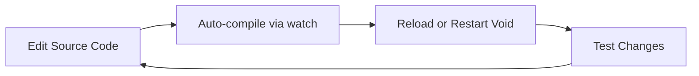

# 🚀 Running and Debugging Void Editor - Complete Guide

**Last Updated:** 2025-12-27 10:30

---

## ✅ Quick Start (Already Tested & Working!)

The Void Editor has been successfully launched and verified. Here are all the methods you can use:

---

## 🎯 Method 1: Quick Launch via Script (Simplest)

### Run Void Editor Directly

```powershell
cd d:\Radd\void
.\scripts\code.bat
```

**What this does:**
- Launches the Void Editor in development mode
- Uses your compiled code from the `out/` directory
- Opens with a separate user data directory (`.vscode-oss-dev`)
- Keeps your regular VS Code installation separate and untouched

**When to use:** Quick testing, verifying the app works, or daily development

---

## 🎯 Method 2: VS Code Debugger (Full Debug Experience)

### Step 1: Open Void Editor workspace in VS Code

Make sure you have the `d:\Radd\void` folder open in VS Code.

### Step 2: Launch with F5

1. Press **F5** (or click Run → Start Debugging)
2. From the dropdown, select one of these configurations:

#### **Recommended Configurations:**

| Configuration Name | Purpose | When to Use |
|-------------------|---------|-------------|
| **"VS Code"** | Full debugging - all processes | **Best for complete debugging** - includes main process, extension host, and renderer |
| **"Launch VS Code Internal"** | Just launch the editor | Quick testing without full debugging |
| **"Main Process"** | Debug the core Electron app | When debugging window management, menus, or native features |
| **"Attach to Extension Host"** | Debug extensions | When debugging extension behavior |

### Step 3: The Void Editor will open in a new window

You'll see:
- A new Void Editor window launches
- Debug toolbar appears in VS Code
- Console output in the Debug Console panel

---

## 🎯 Method 3: Watch Mode (For Active Development)

### Continuous Compilation

```powershell
cd d:\Radd\void
pnpm run watch
```

**What this does:**
- Watches for file changes in `src/`
- Automatically recompiles when you save changes
- Hot-reloads in some cases (renderer process changes)

### Then Launch

In a **separate terminal**:

```powershell
.\scripts\code.bat
```

**When to use:** When actively editing Void Editor source code

---

## 🔍 Understanding the Launch Configurations

### Available in `.vscode/launch.json`:

#### **Compound Configurations** (Multiple debuggers at once)

- **"VS Code"** - Most comprehensive: Launches with debugging for:
  - Main Process (Electron main)
  - Extension Host (where extensions run)
  - Shared Process (background services)
  - Renderer Process (UI)

#### **Individual Configurations**

- **"Launch VS Code Internal"** - Basic launch
- **"Main Process"** - Debug Electron main process
- **"Attach to Extension Host"** - Debug extensions
- **"Attach to Shared Process"** - Debug background processes

---

## 🛠️ Development Workflow

### Standard Development Cycle



### Recommended Workflow:

1. **Start Watch Mode:**
   ```powershell
   pnpm run watch
   ```

2. **Launch Void Editor:**
   - Press F5 in VS Code, OR
   - Run `.\scripts\code.bat`

3. **Make Changes:**
   - Edit files in `src/`
   - Watch automatically compiles to `out/`

4. **Test Changes:**
   - For **renderer** changes: Reload window (Ctrl+R in Void)
   - For **main process** changes: Restart Void Editor

---

## 🐛 Debugging Tips

### Breakpoints

- Set breakpoints in `.ts` files in `src/`
- TypeScript source maps allow debugging original source
- Breakpoints work in:
  - Main process code (Electron main)
  - Renderer process code (UI)
  - Extension host code (extensions)

### Debug Console

Access via VS Code's Debug Console panel:
- View `console.log()` output
- Execute JavaScript in context
- Inspect variables

### Chrome DevTools

While Void Editor is running, you can also use:
- **Help → Toggle Developer Tools** (inside Void)
- Or press `Ctrl+Shift+I` inside the Void Editor window

---

## 📁 Important Directories

| Directory | Purpose |
|-----------|---------|
| `src/` | TypeScript source code |
| `out/` | Compiled JavaScript (auto-generated) |
| `extensions/` | Built-in extensions |
| `scripts/` | Build and launch scripts |
| `.build/electron/` | Downloaded Electron binary |
| `.vscode-oss-dev/` | Development user data (separate from your normal VS Code) |

---

## 🔄 Common Commands

### Build Commands

```powershell
# Full compile (one-time)
pnpm run compile

# Watch mode (continuous)
pnpm run watch

# Full clean build
pnpm run gulp clean
pnpm run compile
```

### Launch Commands

```powershell
# Launch from scripts
.\scripts\code.bat

# Launch with specific folder
.\scripts\code.bat "C:\path\to\test\folder"

# Launch with debugging enabled
.\scripts\code.bat --inspect-brk=5875
```

---

## ⚙️ Environment Variables

You can customize behavior with environment variables:

```powershell
# Enable verbose logging
$env:ELECTRON_ENABLE_LOGGING = 1
.\scripts\code.bat

# Use different user data directory
$env:VSCODE_USER_DATA_DIR = "C:\custom\path"
.\scripts\code.bat

# Skip GPU acceleration (if you have graphics issues)
.\scripts\code.bat --disable-gpu
```

---

## 🧪 Testing Kilo Code Extension

### Step 1: Build Kilo Code VSIX

Already done! ✅ Located at: `d:\Radd\kilocode\bin\kilo-code-4.140.2.vsix`

### Step 2: Install in Void Editor

**Method A: Via UI (After Void launches)**

1. Launch Void Editor (`.\scripts\code.bat`)
2. Open Extensions panel (Ctrl+Shift+X)
3. Click `...` (More Actions) → Install from VSIX
4. Navigate to `d:\Radd\kilocode\bin\kilo-code-4.140.2.vsix`
5. Install and reload

**Method B: Via Command Line**

```powershell
.\scripts\code.bat --install-extension d:\Radd\kilocode\bin\kilo-code-4.140.2.vsix
```

### Step 3: Verify Extension Works

1. Open a folder in Void Editor
2. Look for Kilo Code icon in Activity Bar (left side)
3. Open Kilo Code panel
4. Test basic functionality

---

## 🎯 Completing Step 1.1.4

To fully complete Step 1.1.4 (Test Kilo Code Extension):

1. ✅ Launch Void Editor (done via `.\scripts\code.bat`)
2. Install Kilo Code VSIX in Void Editor
3. Configure API key (OpenAI or local Ollama)
4. Test basic agent functionality:
   - Ask a simple question
   - Test file reading
   - Test memory bank creation

---

## 🔧 Troubleshooting

### Issue: Void Editor won't launch

**Solution:**
```powershell
# Rebuild
pnpm run compile

# Try launching again
.\scripts\code.bat
```

### Issue: Changes not reflecting

**Solution:**
- Make sure watch mode is running
- For main process changes: Restart Void Editor completely
- For renderer changes: Reload window (Ctrl+R inside Void)

### Issue: Can't attach debugger

**Solution:**
- Make sure you're using the launch configurations from `.vscode/launch.json`
- The "VS Code" compound configuration is most reliable

### Issue: Extensions not loading

**Solution:**
```powershell
# Check extensions directory
cd extensions
pnpm install
pnpm run compile
```

---

## 📊 Launch Configuration Reference

### Full "VS Code" Compound Configuration

This is the **recommended** debug configuration. It starts:

1. **Launch VS Code Internal** - Boots the editor
2. **Attach to Main Process** - Debugs Electron main (port 5875)
3. **Attach to Extension Host** - Debugs extensions (port 5870)
4. **Attach to Shared Process** - Debugs background services (port 5879)

**Pre-launch task:** "Ensure Prelaunch Dependencies"

---

## ✅ Verification Checklist

Step 1.1 is **complete** when you can:

- ✅ Launch Void Editor via `.\scripts\code.bat`
- ✅ Launch Void Editor via F5 in VS Code
- ✅ See the Void Editor window open
- ✅ Open a folder in Void Editor
- ✅ Edit files in Void Editor
- 🔄 Install and test Kilo Code extension (Step 1.1.4 - next)

---

## 🎓 Next Steps

Now that Void Editor is running:

1. **Complete Step 1.1.4:** Test Kilo Code extension in Void Editor
2. **Move to Phase 1.2:** Initial branding changes
   - Choose product name
   - Update `product.json`
   - Replace icons

---

## 🔗 Useful Resources

- **VS Code Extension API:** https://code.visualstudio.com/api
- **Electron Docs:** https://www.electronjs.org/docs
- **Void Editor Guide:** See `VOID_CODEBASE_GUIDE.md` in the repository

---

**Status:** ✅ Void Editor successfully running and ready for development!
